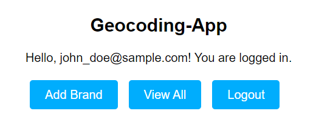

# Geocoding App

The Geocoding App is a web application that allows users to manage brands and their associated addresses. It provides functionality to add, view, and delete brands, as well as geocode addresses using the geopy library.

## Features

- User registration and login: Users can create an account and log in to access the app.
- Add Brand: Users can add a new brand and associate it with multiple addresses.
- View All Brands and Addresses: Users can view a list of all brands and their associated addresses.
- Delete Brand: Users can delete a brand and all its associated addresses.
- Geocode Addresses: Users can geocode the addresses associated with a brand to obtain latitude and longitude coordinates.

## Technologies Used

- Python
- Flask web framework
- SQLAlchemy 
- HTML/CSS for front-end
- Geopy for geocoding functionality

## Prerequisites

- Python 3.7 or higher
- Flask
- SQLAlchemy
- Geopy

## Instructions

### Registration and Login:

1. Open the Geocoding App in your web browser.
2. If you don't have an account, click on the "Register" link on the login page.
3. Fill in your email and password, and submit the form to create a new account.
4. If you already have an account, enter your email and password on the login page and click "Login".

### Adding a Brand and Addresses:

1. After logging in, you will be directed to the home page.
2. Click on the "Add Brand" button to navigate to the brand creation page.
3. Enter the brand name in the provided field.
4. Enter the addresses associated with the brand in the address fields. 
5. Once you have entered all the necessary information, click the "Add Brand and Addresses" button to save the brand and addresses.

### Viewing All Brands and Addresses:

1. On the home page, you will see a list of all brands and their associated addresses.
2. Each brand is displayed with its name and a list of addresses below it.

### Deleting a Brand:

1. To delete a brand and all its associated addresses, locate the brand you want to delete on the home page.
2. Click the "Delete" button next to the brand.
3. A confirmation prompt will appear asking you to confirm the deletion. Click "OK" to proceed or "Cancel" to cancel the deletion.

### Geocoding Addresses:

1. To geocode the addresses associated with a brand, locate the brand on the home page.
2. Click the "Geocode Addresses" button next to the brand.
3. The app will attempt to geocode each address using the geopy library and update the latitude and longitude coordinates.
4. Once the geocoding process is complete, the updated addresses will be displayed on the home page.

### Logout:

To log out of the Geocoding App, click on the "Logout" button located in the navigation menu.
